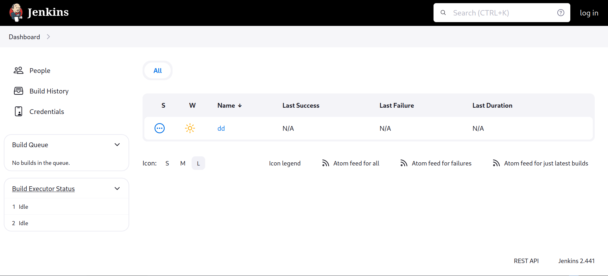
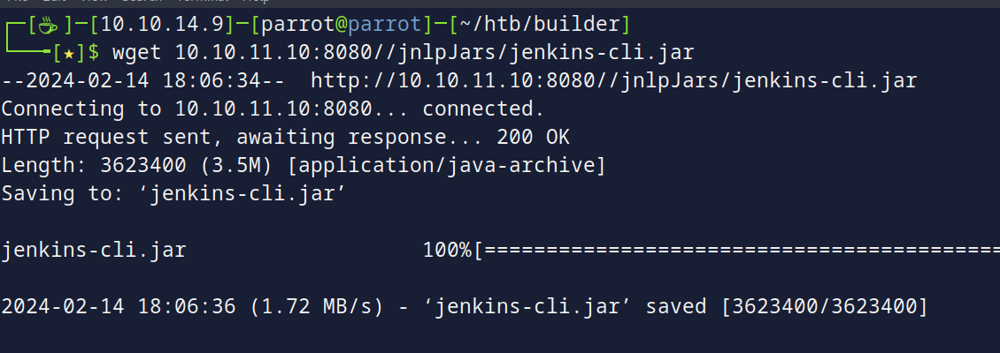
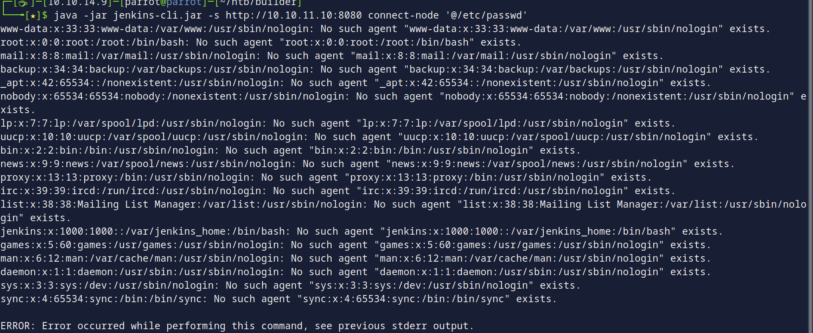
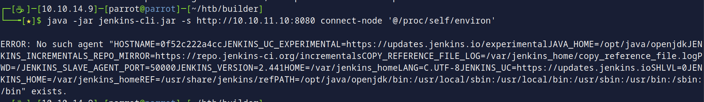
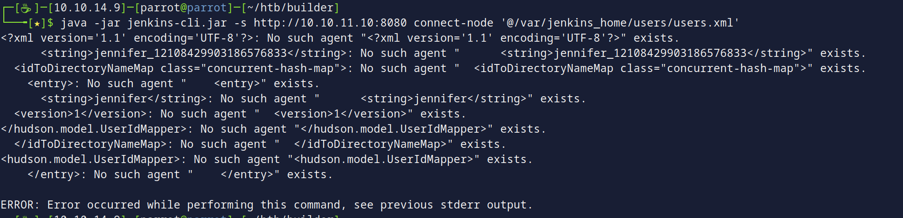
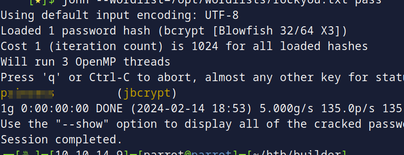
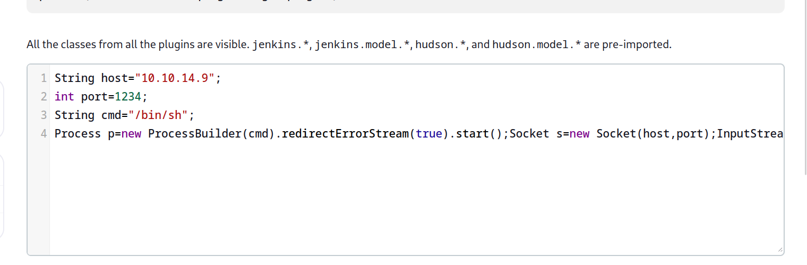
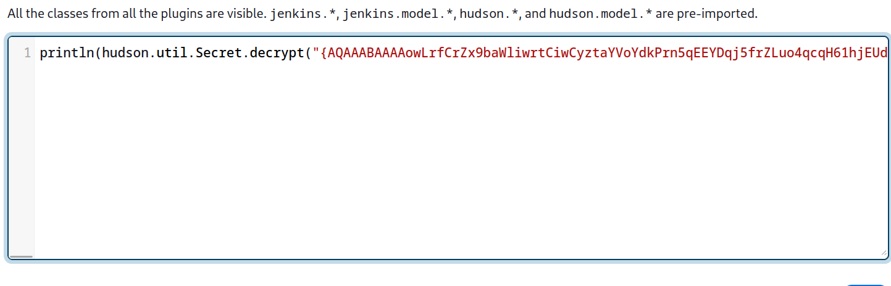
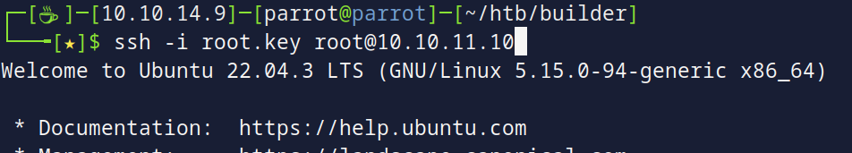
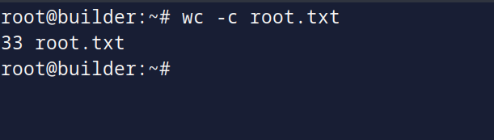

# Builder machine on [hackthebox](https://app.hackthebox.com)

Written by: Mustafa Musallati.

---

### Enumeration:

Let's start by enumeration the machine with nmap.
Nmap scan result:
```
Nmap scan report for 10.10.11.10
Host is up (0.074s latency).
Not shown: 998 closed tcp ports (reset)
PORT     STATE SERVICE VERSION
22/tcp   open  ssh     OpenSSH 8.9p1 Ubuntu 3ubuntu0.6 (Ubuntu Linux; protocol 2.0)
8080/tcp open  http    Jetty 10.0.18
Service Info: OS: Linux; CPE: cpe:/o:linux:linux_kernel

Service detection performed. Please report any incorrect results at https://nmap.org/submit/ .
Nmap done: 1 IP address (1 host up) scanned in 8.65 seconds
```

Two normal ports, ssh and http, let's check the website:


And we see Jenkins!!
Now seeing the 2.441 version, and as expected this box covers the latest Jenkins arbitrary file leak vulnerability.

After looking and reading in the security advisory from Jenkins about the vulnerability, let's first start by downloading the Jenkis cli to interact with the system.



We can use the cli (jar file) using:
```
java -jar "jar file"
```
After messing with it a bit and understanding how to get the available commands, we see we can do "connect-node", and as stated in the vulnerability description, the "@" sign, if followed by file name, will substitute the actual content of the file.

### Exploitation

So for example let's try to put "/etc/passwd", using this command:
```
java -jar jenkins-cli.jar -s 10.10.11.10:8080 connect-node '@/etc/passwd'
```
We see this:


Doing that, we can start reading a bit about the system, but to utilize this further more, we need to know Jenkins store files, and what files can be more interesting to us.


Now Let's check where the home directory is, using environment variables: 


Now seeing it, let's see what users there is, from "/var/jenkins_home/users/users.xml":



we see Jennifer with the ID, having that we can access some files to see the password, going to: `/var/jenkins_home/users/jennifer_12108429903186576833/config.xml`.
Reading that file we will get a file hash, so now let's crack it and get the password:


Let's login!!

Now logging to the website, going to the script console we can execute commands, so let's get a shell on the box.


Getting a shell on the box, now let's start enumerating.

Now going into the home directory again, we see the "credentials.xml" file, it has some private keys for users, including the "root".

but its encrypted, we need to find a way to decrypt it, keep in mind, it's done using the secret key in that directory, so for ease of use, we had to leak the Jennifer user password to login, and then just decrypt this key easily from the script console:



Now After doing that, we will get the root private key, let's save it and login.




And the box is done!

Happy hacking :)

---

Written by: Mustafa Musallati.
[LinkedIn](https://www.linkedin.com/in/mustafa-musallati-95a159260/)
[instagram](https://www.instagram.com/accaard/)
